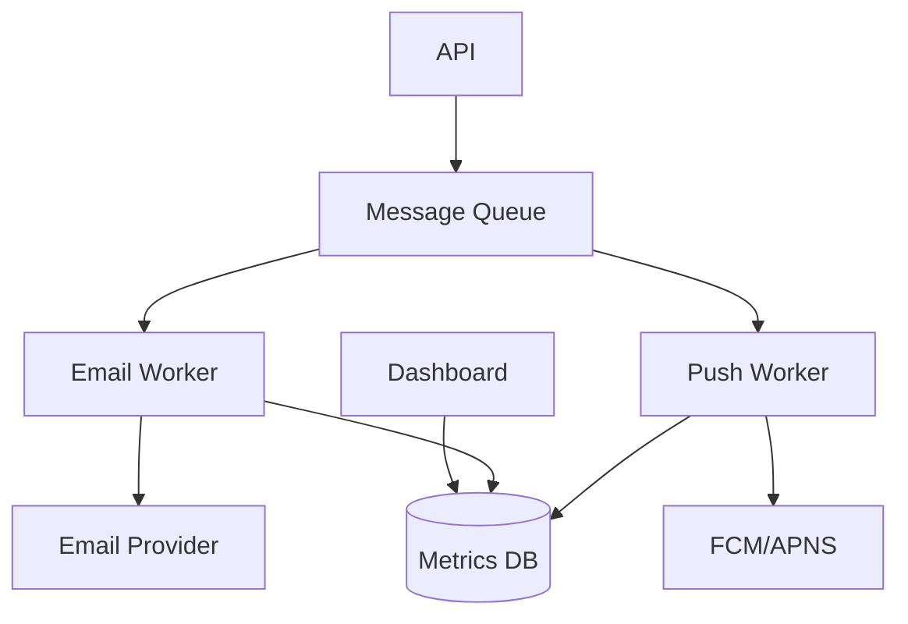

# Exemplo: Blueprint → PRD

## Blueprint Original (Input)

```markdown
# Sistema de Notificações

Precisamos de um sistema para enviar notificações aos usuários.

- Deve suportar email e push notification
- Usuário pode configurar preferências
- Precisa ter fila para não perder mensagens
- Dashboard para ver métricas
```

---

## PRD Gerado (Output)

# PRD: Sistema de Notificações Multicanal

**Versão:** 1.0  
**Data:** 2024-01-15  
**Status:** Draft  

---

## 1. Sumário Executivo

### 1.1 Visão do Produto
O Sistema de Notificações Multicanal é uma plataforma centralizada para gerenciamento e envio de notificações aos usuários através de múltiplos canais (email e push notifications). O sistema resolve o problema de comunicação fragmentada e inconsistente com os usuários, oferecendo uma solução robusta com garantia de entrega através de filas de mensagens.

### 1.2 Público-Alvo
- **Persona Primária:** Usuários finais da plataforma que recebem notificações
- **Persona Secundária:** Equipe de operações que monitora o sistema

---

## 2. Contexto e Problema

### 2.1 Declaração do Problema
Atualmente não existe um sistema centralizado para envio de notificações, resultando em mensagens perdidas, falta de controle sobre preferências do usuário e ausência de visibilidade sobre o status das comunicações.

### 2.2 Custo de Não Resolver
- **Operacional:** Retrabalho manual para reenvio de notificações
- **Experiência:** Usuários perdendo informações importantes
- **Técnico:** Múltiplos sistemas desconectados enviando mensagens

---

## 3. Requisitos Funcionais

### RF-001: Envio de Notificações por Email

**Prioridade:** P0 (Crítico)  
**Complexidade:** M  

##### Descrição
Sistema deve ser capaz de enviar notificações por email para usuários cadastrados, suportando templates HTML e texto plano.

##### Critérios de Aceite
- [ ] **CA-001:** Dado que um evento de notificação é disparado, quando o canal email está habilitado para o usuário, então um email deve ser enqueued para envio em até 100ms
- [ ] **CA-002:** Dado que um email é enviado, quando a entrega falha, então o sistema deve tentar reenvio até 3 vezes com backoff exponencial
- [ ] **CA-003:** Dado que um email foi enviado, quando consultado via API, então deve retornar status (pending, sent, delivered, failed)

##### Regras de Negócio
| ID | Regra |
|----|-------|
| RN-001 | Máximo de 3 tentativas de envio por notificação |
| RN-002 | Intervalo entre tentativas: 1min, 5min, 30min |

---

### RF-002: Envio de Push Notifications

**Prioridade:** P0 (Crítico)  
**Complexidade:** M  

##### Descrição
Sistema deve enviar push notifications para dispositivos móveis registrados (iOS e Android).

##### Critérios de Aceite
- [ ] **CA-001:** Dado que um usuário tem dispositivo registrado, quando uma push é disparada, então deve chegar ao dispositivo em até 5 segundos (p95)
- [ ] **CA-002:** Dado que um usuário tem múltiplos dispositivos, quando uma push é enviada, então todos os dispositivos devem receber

---

### RF-003: Preferências de Notificação do Usuário

**Prioridade:** P1 (Alto)  
**Complexidade:** S  

##### Descrição
Usuários podem configurar quais tipos de notificação desejam receber e por qual canal.

##### Critérios de Aceite
- [ ] **CA-001:** Dado que um usuário acessa configurações, quando altera preferência de canal, então futuras notificações respeitam a configuração
- [ ] **CA-002:** Dado que um usuário desabilita todas as notificações de um tipo, quando esse evento ocorre, então nenhuma notificação desse tipo é enviada

---

### RF-004: Fila de Mensagens

**Prioridade:** P0 (Crítico)  
**Complexidade:** L  

##### Descrição
Todas as notificações devem passar por uma fila de mensagens para garantir entrega e resiliência.

##### Critérios de Aceite
- [ ] **CA-001:** Dado que o serviço de email está indisponível, quando uma notificação é criada, então ela permanece na fila até poder ser processada
- [ ] **CA-002:** Dado que há 10.000 mensagens na fila, quando o sistema processa, então não há perda de mensagens

---

### RF-005: Dashboard de Métricas

**Prioridade:** P1 (Alto)  
**Complexidade:** M  

##### Descrição
Dashboard para visualização de métricas de envio, taxa de entrega e falhas.

##### Critérios de Aceite
- [ ] **CA-001:** Dashboard exibe total de notificações enviadas por canal nas últimas 24h
- [ ] **CA-002:** Dashboard exibe taxa de sucesso/falha em tempo real
- [ ] **CA-003:** Dashboard permite filtro por período e tipo de notificação

---

## 4. Requisitos Não-Funcionais

### RNF-001: Performance
| Métrica | SLA |
|---------|-----|
| Tempo de enqueue | < 100ms p99 |
| Throughput | > 10.000 msg/min |

### RNF-002: Disponibilidade
- **SLA:** 99.9%
- **RPO:** 0 (sem perda de mensagens)

---

## 5. Arquitetura



---

## 6. User Stories

### US-001: Receber notificação por email
**Como** usuário  
**Quero** receber notificações importantes por email  
**Para** não perder informações relevantes  

### US-002: Configurar preferências
**Como** usuário  
**Quero** escolher como recebo notificações  
**Para** ter controle sobre minha experiência  

### US-003: Monitorar sistema
**Como** operador  
**Quero** visualizar métricas de envio  
**Para** identificar problemas rapidamente  

---

## 7. Fora do Escopo (v1)
- ❌ SMS como canal de notificação
- ❌ Notificações in-app
- ❌ Agendamento de notificações
- ❌ A/B testing de mensagens

---

Este exemplo demonstra como um blueprint simples de 4 linhas se transforma em um PRD estruturado e implementável.
