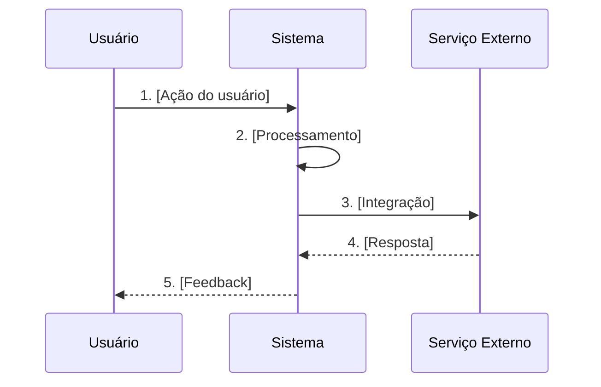
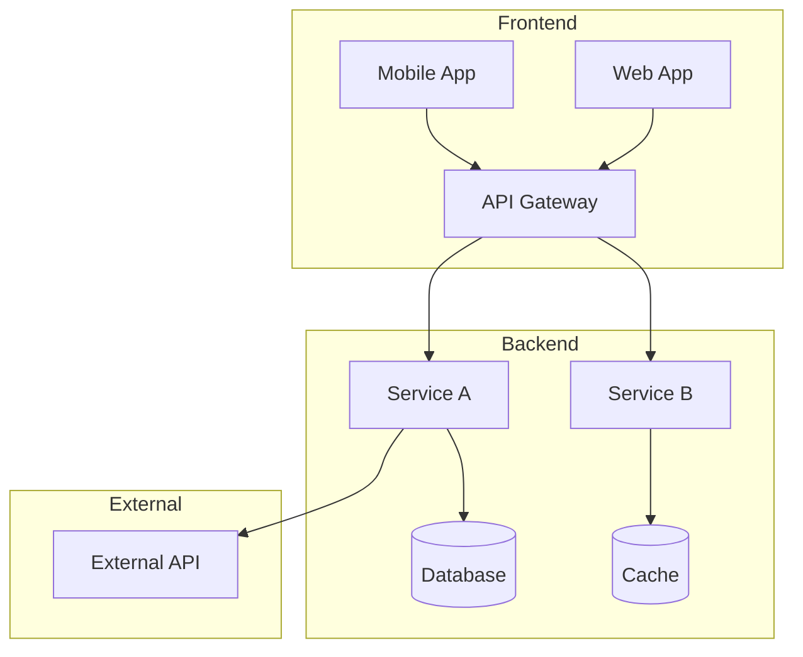
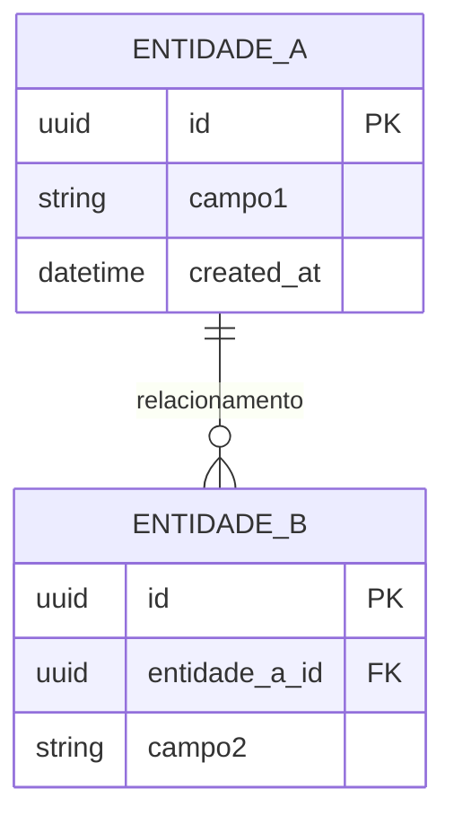
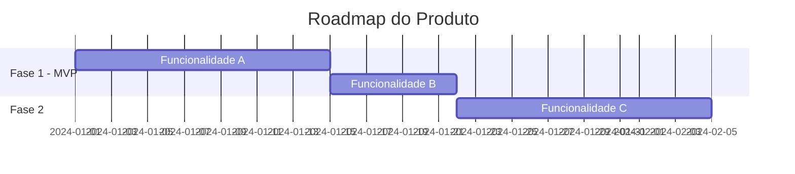

# Template PRD Completo

Este template serve como referência para geração de PRDs a partir de blueprints.

---

# PRD: [NOME_DO_PRODUTO]

**Versão:** 1.0  
**Data:** [DATA_ATUAL]  
**Autor:** [AUTOR]  
**Status:** Draft | Em Revisão | Aprovado  

---

## 1. Sumário Executivo

### 1.1 Visão do Produto
[2-3 parágrafos descrevendo o produto, o problema que resolve e a proposta de valor única]

### 1.2 Público-Alvo
- **Persona Primária:** [Descrição]
- **Persona Secundária:** [Descrição]

### 1.3 Proposta de Valor
> [Uma frase que captura o valor central do produto]

---

## 2. Contexto e Problema

### 2.1 Background
[Contexto histórico e situação atual que levou à necessidade deste produto]

### 2.2 Declaração do Problema
**Para** [público-alvo]  
**Que** [tem este problema/necessidade]  
**O** [nome do produto]  
**É um** [categoria do produto]  
**Que** [benefício principal]  
**Diferente de** [alternativa atual]  
**Nosso produto** [diferencial competitivo]  

### 2.3 Evidências do Problema
| Fonte | Insight | Impacto |
|-------|---------|---------|
| [Pesquisa/Dados] | [O que foi descoberto] | [Quantificação] |

### 2.4 Custo de Não Resolver
- **Financeiro:** [R$ ou % de perda]
- **Operacional:** [Horas/recursos desperdiçados]
- **Estratégico:** [Oportunidades perdidas]

---

## 3. Objetivos e Métricas

### 3.1 Objetivos de Negócio
| ID | Objetivo | Métrica | Baseline | Meta | Prazo |
|----|----------|---------|----------|------|-------|
| OBJ-001 | [Objetivo] | [KPI] | [Valor atual] | [Valor esperado] | [Data] |

### 3.2 Objetivos do Usuário
| Persona | Objetivo | Como Medimos Sucesso |
|---------|----------|----------------------|
| [Persona] | [Job-to-be-done] | [Métrica de satisfação] |

### 3.3 North Star Metric
**Métrica Principal:** [A única métrica que indica sucesso do produto]

---

## 4. Requisitos Funcionais

### 4.1 Mapa de Funcionalidades

```
[Produto]
├── [Módulo 1]
│   ├── RF-001: [Funcionalidade]
│   └── RF-002: [Funcionalidade]
├── [Módulo 2]
│   ├── RF-003: [Funcionalidade]
│   └── RF-004: [Funcionalidade]
└── [Módulo 3]
    └── RF-005: [Funcionalidade]
```

### 4.2 Detalhamento dos Requisitos

---

#### RF-001: [Nome da Funcionalidade]

**Módulo:** [Nome do módulo]  
**Prioridade:** P0 (Crítico) | P1 (Alto) | P2 (Médio) | P3 (Baixo)  
**Complexidade:** XS | S | M | L | XL  
**Dependências:** [RF-XXX, Sistema Externo, etc.]  

##### Descrição
[Descrição detalhada e completa da funcionalidade]

##### Critérios de Aceite
- [ ] **CA-001:** [Dado que] [contexto], [quando] [ação], [então] [resultado esperado]
- [ ] **CA-002:** [Critério específico, mensurável e testável]
- [ ] **CA-003:** [Critério de borda/edge case]

##### Regras de Negócio
| ID | Regra | Exemplo |
|----|-------|---------|
| RN-001 | [Regra específica] | [Caso concreto] |
| RN-002 | [Validação/Restrição] | [Exemplo de aplicação] |

##### Fluxo Principal


1. Usuário [ação inicial]
2. Sistema [validação/processamento]
3. Sistema [próximo passo]
4. Sistema [feedback ao usuário]

##### Fluxos Alternativos
| ID | Condição | Comportamento |
|----|----------|---------------|
| FA-001 | [Quando X acontece] | [Sistema faz Y] |
| FA-002 | [Variação do fluxo] | [Comportamento alternativo] |

##### Fluxos de Exceção
| ID | Erro | Mensagem | Ação do Sistema |
|----|------|----------|-----------------|
| FE-001 | [Tipo de erro] | "[Mensagem ao usuário]" | [Como sistema se recupera] |
| FE-002 | [Falha de integração] | "[Mensagem]" | [Retry/Fallback] |

##### UI/UX Notes
- [Considerações de interface]
- [Comportamentos esperados]
- [Estados da UI: loading, empty, error, success]

##### Notas Técnicas
- [Considerações de implementação]
- [Algoritmos sugeridos]
- [Limitações conhecidas]

---

[REPETIR ESTRUTURA PARA CADA RF-XXX]

---

## 5. Requisitos Não-Funcionais

### 5.1 Performance
| ID | Requisito | Métrica | SLA |
|----|-----------|---------|-----|
| RNF-P01 | Tempo de resposta API | p95 latency | < 200ms |
| RNF-P02 | Tempo de carregamento página | First Contentful Paint | < 1.5s |
| RNF-P03 | Throughput | Requests/segundo | > 1000 rps |

### 5.2 Segurança
| ID | Requisito | Implementação |
|----|-----------|---------------|
| RNF-S01 | Autenticação | [JWT/OAuth2/etc] |
| RNF-S02 | Autorização | [RBAC/ABAC] |
| RNF-S03 | Criptografia | [Em trânsito: TLS 1.3, Em repouso: AES-256] |
| RNF-S04 | LGPD/GDPR | [Requisitos de compliance] |

### 5.3 Escalabilidade
| Cenário | Capacidade Atual | Capacidade Necessária |
|---------|------------------|----------------------|
| Usuários simultâneos | [X] | [Y] |
| Volume de dados | [X GB/mês] | [Y GB/mês] |
| Pico de tráfego | [X rps] | [Y rps] |

### 5.4 Disponibilidade
- **SLA:** [99.9%]
- **RTO (Recovery Time Objective):** [X minutos]
- **RPO (Recovery Point Objective):** [X minutos]
- **Janela de Manutenção:** [Quando permitido]

### 5.5 Observabilidade
- **Logs:** [Requisitos de logging]
- **Métricas:** [Métricas a coletar]
- **Traces:** [Distributed tracing requirements]
- **Alertas:** [Condições de alerta]

---

## 6. Arquitetura e Design Técnico

### 6.1 Diagrama de Arquitetura



### 6.2 Stack Tecnológica
| Camada | Tecnologia | Versão | Justificativa |
|--------|------------|--------|---------------|
| Frontend | [React/Vue/etc] | [X.X] | [Razão da escolha] |
| Backend | [Node/Python/etc] | [X.X] | [Razão da escolha] |
| Database | [PostgreSQL/etc] | [X.X] | [Razão da escolha] |
| Cache | [Redis/etc] | [X.X] | [Razão da escolha] |
| Infra | [AWS/GCP/etc] | - | [Razão da escolha] |

### 6.3 Modelo de Dados



### 6.4 APIs e Integrações

#### APIs Internas
| Endpoint | Método | Descrição | Request | Response |
|----------|--------|-----------|---------|----------|
| /api/v1/resource | GET | [Descrição] | [Params] | [Schema] |
| /api/v1/resource | POST | [Descrição] | [Body] | [Schema] |

#### Integrações Externas
| Sistema | Tipo | Propósito | SLA Esperado |
|---------|------|-----------|--------------|
| [Sistema X] | REST API | [Para que] | [99.X%] |
| [Sistema Y] | Webhook | [Para que] | [Latência] |

---

## 7. User Stories e Épicos

### Épico 1: [Nome do Épico]

**Descrição:** [Objetivo do épico]  
**Valor de Negócio:** [Por que isso importa]  
**Requisitos Relacionados:** RF-001, RF-002  

#### US-001: [Título da Story]
**Como** [tipo de usuário]  
**Quero** [ação/funcionalidade]  
**Para** [benefício/valor]  

- **Prioridade:** Alta | Média | Baixa
- **Story Points:** [1-13]
- **Sprint Sugerida:** [X]
- **Dependências:** [US-XXX]
- **Requisitos:** RF-001
- **Critérios de Aceite:** CA-001, CA-002

#### US-002: [Título]
[Mesma estrutura...]

---

## 8. Roadmap e Cronograma

### 8.1 Visão de Fases



### 8.2 Fase 1: MVP
**Duração:** [X semanas]  
**Objetivo:** [Meta principal do MVP]  

| Entregável | Requisitos | Responsável | Início | Fim |
|------------|------------|-------------|--------|-----|
| [Feature] | RF-001, RF-002 | [Time/Pessoa] | [Data] | [Data] |

**Critérios de Sucesso do MVP:**
- [ ] [Critério mensurável]
- [ ] [Critério mensurável]

### 8.3 Fase 2: [Nome]
[Mesma estrutura...]

---

## 9. Riscos e Mitigações

| ID | Risco | Probabilidade | Impacto | Score | Mitigação | Owner |
|----|-------|---------------|---------|-------|-----------|-------|
| R-001 | [Descrição do risco] | Alta/Média/Baixa | Alto/Médio/Baixo | [1-9] | [Ação preventiva] | [Responsável] |
| R-002 | [Dependência externa atrasar] | Média | Alto | 6 | [Plano B] | [Nome] |

### Matriz de Riscos
```
Impacto
Alto    | R-001 |       | R-002 |
Médio   |       |       |       |
Baixo   |       |       |       |
        | Baixa | Média | Alta  |
                Probabilidade
```

---

## 10. Dependências

### 10.1 Dependências Internas
| Dependência | Time Responsável | Status | Data Necessária | Impacto se Atrasar |
|-------------|------------------|--------|-----------------|-------------------|
| [API X] | [Time Y] | [Status] | [Data] | [Bloqueio em RF-XXX] |

### 10.2 Dependências Externas
| Fornecedor/Sistema | Tipo | Contrato | SLA | Plano B |
|--------------------|------|----------|-----|---------|
| [Sistema X] | API | [Sim/Não] | [X%] | [Alternativa] |

---

## 11. Fora do Escopo

> **Importante:** Os itens abaixo foram deliberadamente excluídos desta versão.

- ❌ [Funcionalidade X] - *Razão: será considerada na v2*
- ❌ [Integração Y] - *Razão: custo-benefício não justifica*
- ❌ [Feature Z] - *Razão: não alinhada com objetivo do MVP*

---

## 12. Questões em Aberto

| ID | Questão | Impacto | Owner | Deadline | Status |
|----|---------|---------|-------|----------|--------|
| Q-001 | [Decisão pendente] | [RF-XXX bloqueado] | [Nome] | [Data] | Aberto |

---

## 13. Glossário

| Termo | Definição | Contexto |
|-------|-----------|----------|
| [Termo técnico] | [Definição clara] | [Onde é usado] |
| [Sigla] | [Significado completo] | [Relevância] |

---

## 14. Referências

- [Link para pesquisa de usuário]
- [Link para análise competitiva]
- [Link para documentação técnica relacionada]
- [Link para designs/protótipos]

---

## 15. Aprovações

| Papel | Nome | Data | Assinatura |
|-------|------|------|------------|
| Product Owner | [Nome] | [Data] | ☐ Aprovado |
| Tech Lead | [Nome] | [Data] | ☐ Aprovado |
| Design Lead | [Nome] | [Data] | ☐ Aprovado |
| Stakeholder | [Nome] | [Data] | ☐ Aprovado |

---

## Histórico de Revisões

| Versão | Data | Autor | Mudanças |
|--------|------|-------|----------|
| 1.0 | [Data] | [Nome] | Versão inicial |
| 1.1 | [Data] | [Nome] | [Descrição das mudanças] |
