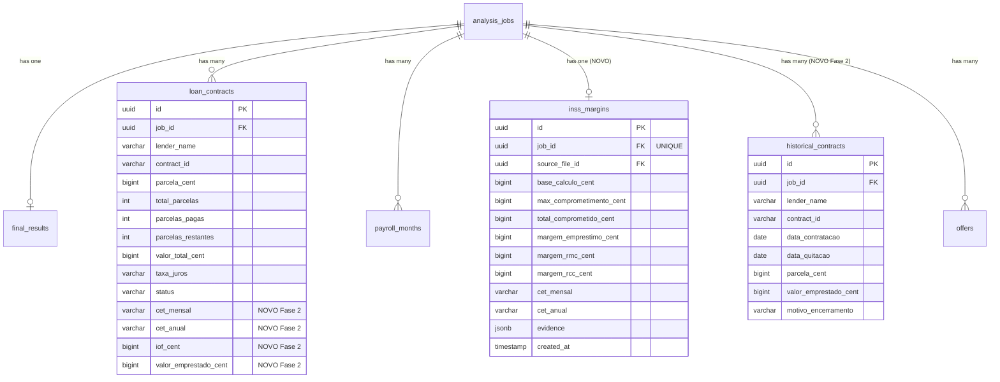

# PRD: Evolução do Relatório PDF — Diagnóstico Financeiro v2

## Metadados

| Campo | Valor |
|-------|-------|
| **Versão** | 2.0 |
| **Data** | 05/02/2026 |
| **Status** | Proposta para Revisão |
| **Autor** | Claude (revisão técnica) |
| **Stack** | FastAPI 0.128 + Next.js 16 + PostgreSQL 18 + jsPDF 2.x |
| **Prioridade** | P0 — Core Business |

---

## Sumário Executivo

O sistema atual da Calculadora de Consignados extrai dados ricos de contracheques e extratos INSS via OCR/LLM (nome do banco, taxa de juros, CET, parcelas por contrato, margem INSS por modalidade), porém o relatório PDF exportado resume toda essa riqueza em apenas 7 números totalizados num layout "antes e depois" de 1 página.

Este PRD detalha a evolução para um diagnóstico financeiro multi-página (3-4 páginas A4) que exibe: tabela de contratos por banco com taxa e CET, breakdown das linhas de consignado do contracheque, dados de margem INSS (empréstimo/RMC/RCC), custo real da dívida, simulação de economia por portabilidade, e ofertas de renegociação.

A implementação segue 3 fases incrementais: **Fase 1** surfaceia dados já extraídos (quick wins, mínima mudança no backend); **Fase 2** enriquece a extração com novos campos dos documentos (CET, IOF, histórico); **Fase 3** adiciona seções avançadas (mapa visual de dívidas, timeline de refinanciamentos, CTA de conversão).

---

## Problema

### Contexto

A Calculadora de Consignados é uma ferramenta de conversão de leads: pessoas físicas endividadas (servidores públicos, beneficiários INSS) enviam contracheque e extrato de consignado via WhatsApp/formulário, o sistema processa via OCR+LLM, e gera um relatório PDF como ferramenta de venda para contratação de consultoria financeira.

O pipeline de processamento (PDF Extraction → Router LLM → Extractors LLM → Evidence Gate → Consolidator → Compute Engine → Offers) já extrai ~20 campos por contrato e armazena dados detalhados por linha do contracheque. No entanto, o relatório PDF final condensa tudo em 7 números genéricos.

### Problema Principal

**Gap de dados:** O backend extrai e armazena dados ricos e personalizados (banco, taxa, CET, parcelas individuais, margem INSS por modalidade), mas o PDF exportado mostra apenas 7 totais agregados. O lead recebe um documento genérico que não diferencia sua situação de nenhum outro, reduzindo drasticamente o poder de conversão do relatório.

### Impacto do Problema

| Dimensão | Impacto Atual | Impacto Esperado (pós-v2) |
|----------|---------------|---------------------------|
| **Campos no PDF** | 7 números agregados | 25+ campos personalizados |
| **Personalização** | Nenhuma — todos iguais | Dados por contrato, banco, modalidade |
| **Conversão lead→consultoria** | Baseline | +15% estimado |
| **Percepção do lead** | "Documento genérico" | "Mostra exatamente minha situação" |
| **Dados desperdiçados** | ~80% dos dados extraídos | ~5% (margem mínima para Fase 2+) |

---

## Solução Proposta

### Visão Geral

Transformar o relatório PDF de 1 página com 7 totais em um diagnóstico financeiro multi-página (3-4 páginas A4) que exibe todos os dados já extraídos pelo backend, organizados em seções temáticas com renderização condicional (seções aparecem somente quando os dados existem).

**Premissa crítica:** As únicas fontes de dados reais são o contracheque e o extrato de consignado enviados pelo lead. Toda referência a fontes não consultadas (Serasa, Boa Vista, SPC, Quod, Open Finance, Registrato/SCR) deve ser removida. Todo dado exibido como "confirmado" deve vir exclusivamente dos documentos enviados.

### Estratégia de Dados: 3 Camadas

| Camada | Definição | Formato no PDF |
|--------|-----------|----------------|
| **1 — CONFIRMADO** | Dados reais extraídos dos documentos | Exibido como fato ("Sua taxa é 1,80% a.m.") |
| **2 — INDICAÇÃO** | Inferências razoáveis a partir da Camada 1 | Exibido com ressalva ("Com base nos documentos, indica-se que...") |
| **3 — NÃO DISPONÍVEL** | Requer fontes externas (bureaus, Registrato) | Gancho de conversão ("Na consultoria, revelamos...") |

### Objetivos e Métricas de Sucesso

| # | Objetivo | Métrica | Meta |
|---|----------|---------|------|
| O-001 | Aumentar conversão de leads | Taxa de conversão lead → consultoria | +15% após Fase 1 |
| O-002 | Personalizar relatório | Campos exibidos por relatório | 25+ (vs. 7 atual) |
| O-003 | Manter performance | Tempo de export do PDF | < 10 segundos |
| O-004 | Satisfação do lead | Feedback qualitativo | "O relatório mostra exatamente minha situação" |
| O-005 | Backwards compatibility | Relatórios de jobs antigos | Continuam funcionando (campos null = seção omitida) |

---

## Requisitos Funcionais

### FASE 1 — Surfacear Dados Existentes (Quick Wins)

---

### RF-001: Tabela de Contratos por Banco

**Prioridade:** P0
**Estimativa:** M (Medium)
**Fase:** 1

**Descrição:**
Exibir no PDF uma tabela com todos os `LoanContract` ativos do job, mostrando dados individuais por contrato. O objetivo é que o lead veja exatamente quais bancos têm empréstimos e quanto paga em cada um — dados que já existem no model `LoanContract` mas nunca chegaram ao relatório.

**Fonte dos dados:** Model `LoanContract` (campo `job_id`, já persistido no banco). Necessita apenas adicionar ao schema de resposta da API e ao componente PDF.

**Campos por contrato:**

| Campo | Model/Campo | Tipo | Formato no PDF |
|-------|-------------|------|----------------|
| Nome do banco | `lender_name` | str | Texto |
| Parcela mensal | `parcela_cent` | int (centavos) | R$ X.XXX,XX |
| Parcelas restantes | `parcelas_restantes` | int | Número |
| Saldo devedor | `valor_total_cent` | int (centavos) | R$ XX.XXX,XX |
| Taxa de juros | `taxa_juros` | str | X,XX% a.m. |
| Status | `status` | enum | ATIVO / QUITADO |

**Critérios de Aceite:**
- [ ] CA-001: O endpoint `GET /v1/analysis/jobs/{job_id}/result` retorna array `loan_contracts[]` com todos os campos acima para cada `LoanContract` com `job_id` correspondente
- [ ] CA-002: O PDF renderiza tabela com header + 1 linha por contrato ativo
- [ ] CA-003: A última linha da tabela exibe totalização (soma parcelas, soma saldo devedor)
- [ ] CA-004: Se não há `LoanContract` para o job, a seção é omitida no PDF (sem erro, sem placeholder)
- [ ] CA-005: Contratos com `status = QUITADO` aparecem em seção separada ou com indicador visual diferenciado
- [ ] CA-006: Valores monetários formatados no padrão BR (R$ 1.234,56)

**Regras de Negócio:**
- RN-001: Apenas contratos vinculados ao `job_id` atual são exibidos
- RN-002: Contratos sem `lender_name` exibem "Banco não identificado"
- RN-003: Contratos sem `taxa_juros` exibem "—" (travessão)
- RN-004: Ordenação por `parcela_cent` DESC (maior parcela primeiro)

**Fluxo Principal:**
1. Frontend chama `GET /v1/analysis/jobs/{job_id}/result`
2. Backend faz query `LoanContract.filter(job_id=job_id)` com `selectinload`
3. Serializa cada contrato no sub-schema `LoanContractDetail`
4. Frontend recebe array e renderiza componente `ContractsTable`
5. Na exportação PDF, `ContractsTable` é renderizado como seção da Página 2

**Fluxos de Exceção:**
- FE-001: Job sem contratos → seção omitida silenciosamente
- FE-002: Contrato com todos os campos null exceto `job_id` → linha omitida

**Alterações técnicas:**

| Arquivo | Ação | Detalhe |
|---------|------|---------|
| `backend/app/schemas/final_result.py` | Modificar | Novo sub-schema `LoanContractDetail` |
| `backend/app/api/v1/analysis.py` | Modificar | Query `LoanContract` por `job_id` no endpoint result |
| `frontend/src/types/api.ts` | Modificar | Nova interface `LoanContractDetail` |
| `frontend/src/components/pdf-sections/contracts-table.tsx` | Criar | Componente tabela de contratos |
| `frontend/src/components/result-snapshot.tsx` | Modificar | Incluir `ContractsTable` na Página 2 |

---

### RF-002: Breakdown das Linhas de Consignado do Contracheque

**Prioridade:** P0
**Estimativa:** M (Medium)
**Fase:** 1

**Descrição:**
Exibir no PDF as linhas individuais de consignado extraídas do contracheque, mostrando banco + tipo + valor de cada desconto. Quando não há `LoanContract` detalhado (ex: lead enviou apenas contracheque, sem extrato INSS), estas linhas são a única visão detalhada dos empréstimos.

**Fonte dos dados:** `PayrollMonth.consignado_lines` (JSONB, já armazenado). Cada linha contém: `descricao` (texto com nome do banco + tipo), `rubrica` (código da rubrica), `valor_cent` (valor em centavos).

**Critérios de Aceite:**
- [ ] CA-001: O endpoint retorna array `consignado_lines[]` com descricao, rubrica e valor_brl
- [ ] CA-002: O PDF renderiza lista com 1 linha por desconto de consignado do contracheque
- [ ] CA-003: A última linha exibe total dos consignados
- [ ] CA-004: Se `consignado_lines` é vazio ou null, a seção é omitida
- [ ] CA-005: Quando ambos `loan_contracts[]` e `consignado_lines[]` existem, ambas as seções aparecem (contratos na tabela principal, linhas do contracheque como complemento)

**Regras de Negócio:**
- RN-001: Se há `LoanContract` detalhado E `consignado_lines`, exibir ambos com rótulos distintos ("Contratos Identificados" vs "Linhas do Contracheque")
- RN-002: Se há apenas `consignado_lines` (sem `LoanContract`), exibir como seção principal de detalhamento
- RN-003: Ordenação por `valor_cent` DESC

**Alterações técnicas:**

| Arquivo | Ação | Detalhe |
|---------|------|---------|
| `backend/app/schemas/final_result.py` | Modificar | Novo sub-schema `ConsignadoLineDetail` |
| `backend/app/api/v1/analysis.py` | Modificar | Query `PayrollMonth` por `job_id`, extrair `consignado_lines` |
| `frontend/src/types/api.ts` | Modificar | Nova interface `ConsignadoLineDetail` |
| `frontend/src/components/pdf-sections/consignado-breakdown.tsx` | Criar | Componente de breakdown |

---

### RF-003: Dados de Margem INSS

**Prioridade:** P0
**Estimativa:** L (Large)
**Fase:** 1

**Descrição:**
Quando o documento processado é um extrato INSS (`router_family = INSS_EXTRATO_CONSIGNADO`), extrair e exibir no PDF os dados oficiais de margem por modalidade. Requer novo model no banco de dados, novo extractor regex e novo componente frontend.

**Dados a exibir:**

| Dado | Campo no Model | Exemplo |
|------|----------------|---------|
| Base de cálculo do benefício | `base_calculo_cent` | R$ 1.621,00 |
| Máximo de comprometimento | `max_comprometimento_cent` | R$ 729,45 |
| Total comprometido | `total_comprometido_cent` | R$ 611,35 |
| Margem disponível — Empréstimo | `margem_emprestimo_cent` | R$ 37,05 |
| Margem disponível — RMC | `margem_rmc_cent` | R$ 0,00 |
| Margem disponível — RCC | `margem_rcc_cent` | R$ 81,05 |
| CET mensal | `cet_mensal` | 1,81% |
| CET anual | `cet_anual` | 24,14% |

**Critérios de Aceite:**
- [ ] CA-001: Nova tabela `inss_margins` criada via Alembic migration
- [ ] CA-002: Extrator regex parseia seção "Margem para Empréstimo/Cartão e Resumo Financeiro" e tabela "VALORES POR MODALIDADE" do extrato INSS
- [ ] CA-003: Dados de margem persistidos no model `INSSMargin` vinculado ao `job_id`
- [ ] CA-004: Endpoint retorna objeto `inss_margin` com todos os campos quando disponível
- [ ] CA-005: PDF renderiza seção de margem INSS com os 3 tipos de margem destacados
- [ ] CA-006: Se margem = 0 em qualquer modalidade, exibir "Esgotada" com indicador visual vermelho
- [ ] CA-007: Se não há extrato INSS processado, seção omitida silenciosamente
- [ ] CA-008: Valores de margem com precisão de centavos

**Regras de Negócio:**
- RN-001: Um job pode ter no máximo 1 registro `INSSMargin` (constraint UNIQUE em `job_id`)
- RN-002: CET mensal/anual são armazenados como string (formato "X,XX%")
- RN-003: Margem = 0 indica modalidade esgotada
- RN-004: Se `base_calculo_cent` é null, toda a seção de margem é omitida

**Schema do Banco de Dados:**

```sql
CREATE TABLE inss_margins (
    id UUID PRIMARY KEY DEFAULT gen_random_uuid(),
    job_id UUID NOT NULL UNIQUE REFERENCES analysis_jobs(id) ON DELETE CASCADE,
    source_file_id UUID REFERENCES uploaded_files(id),
    base_calculo_cent BIGINT,
    max_comprometimento_cent BIGINT,
    total_comprometido_cent BIGINT,
    margem_emprestimo_cent BIGINT,
    margem_rmc_cent BIGINT,
    margem_rcc_cent BIGINT,
    cet_mensal VARCHAR(20),
    cet_anual VARCHAR(20),
    evidence JSONB,
    created_at TIMESTAMP NOT NULL DEFAULT now()
);

CREATE INDEX ix_inss_margins_job_id ON inss_margins(job_id);
```

**Alterações técnicas:**

| Arquivo | Ação | Detalhe |
|---------|------|---------|
| `backend/app/models/inss_margin.py` | Criar | Model SQLAlchemy `INSSMargin` |
| `backend/app/models/__init__.py` | Modificar | Registrar `INSSMargin` |
| `backend/alembic/versions/xxx_add_inss_margins.py` | Criar | Migration |
| `backend/app/services/extractors.py` | Modificar | Novo método `_extract_inss_margin_data()` com regex |
| `backend/app/workers/tasks.py` | Modificar | Chamar extrator de margem quando `router_family = INSS_EXTRATO_CONSIGNADO` |
| `backend/app/schemas/final_result.py` | Modificar | Novo sub-schema `INSSMarginDetail` |
| `backend/app/api/v1/analysis.py` | Modificar | Query `INSSMargin` por `job_id` |
| `frontend/src/types/api.ts` | Modificar | Nova interface `INSSMarginDetail` |
| `frontend/src/components/pdf-sections/inss-margin-section.tsx` | Criar | Componente de margem INSS |

---

### RF-004: Ofertas no PDF

**Prioridade:** P1
**Estimativa:** S (Small)
**Fase:** 1

**Descrição:**
As ofertas (PRINCIPAL, REDUZIDA, SUPER) já são geradas pelo `OfferService` e exibidas na página web de resultado, mas não são incluídas no PDF exportado. Adicionar seção de ofertas ao PDF com destaque visual.

**Critérios de Aceite:**
- [ ] CA-001: PDF contém seção de ofertas com as 3 ofertas (PRINCIPAL, REDUZIDA, SUPER) quando disponíveis
- [ ] CA-002: Cada oferta exibe: nome do plano, parcelas, valor da parcela, valor total, método de pagamento
- [ ] CA-003: A oferta PRINCIPAL tem destaque visual (borda ou background diferenciado)
- [ ] CA-004: Se não há ofertas, seção é omitida
- [ ] CA-005: Ofertas seguem a mesma ordem da página web (REDUZIDA → PRINCIPAL → SUPER)

**Regras de Negócio:**
- RN-001: Dados vêm do mesmo endpoint já existente (campo `offers[]` do `FinalResultResponse`)
- RN-002: Formato monetário padrão BR

**Alterações técnicas:**

| Arquivo | Ação | Detalhe |
|---------|------|---------|
| `frontend/src/components/pdf-sections/offers-section.tsx` | Criar | Componente de ofertas para PDF |
| `frontend/src/components/result-snapshot.tsx` | Modificar | Incluir `OffersSection` na Página 3 |

---

### RF-005: Redesign Multi-Página do PDF

**Prioridade:** P0
**Estimativa:** XL (Extra Large)
**Fase:** 1

**Descrição:**
O PDF atual é 1 página fixa (1240×1754px), gerada como imagem PNG embutida em jsPDF. Não suporta conteúdo adicional. Redesign do `ResultSnapshot` para estrutura multi-página com page breaks CSS. Cada seção é renderizada como div com dimensões A4, convertida individualmente para PNG via `html-to-image` e adicionada como página no jsPDF.

**Estrutura proposta:**

| Página | Título | Conteúdo | Condicional? |
|--------|--------|----------|--------------|
| 1 | Retrato Financeiro | Header (nome/data), salário (bruto/líquido/descontos), barra de comprometimento, destaque de economia | Sempre presente |
| 2 | Detalhamento | Tabela de contratos OU linhas de consignado (RF-001 / RF-002) | Presente se há contratos OU linhas |
| 3 | Margem e Ofertas | Dados de margem INSS (RF-003) + ofertas (RF-004) | Presente se há margem OU ofertas |
| 4 | Metodologia e CTA | Como os dados foram obtidos, disclaimer, "O que não sabemos", call-to-action | Sempre presente |

**Critérios de Aceite:**
- [ ] CA-001: PDF gerado contém entre 2 e 4 páginas (depende dos dados disponíveis)
- [ ] CA-002: Cada página tem dimensões A4 corretas (794×1123px na tela → 210×297mm no PDF)
- [ ] CA-003: Layout profissional com header consistente em todas as páginas (nome do lead + data + logo placeholder)
- [ ] CA-004: Tempo total de export (renderização + conversão + download) < 10 segundos
- [ ] CA-005: Nenhum conteúdo cortado entre páginas — cada seção cabe inteira em sua página
- [ ] CA-006: Relatórios de jobs antigos (sem dados novos) geram PDF válido com Páginas 1 e 4 apenas
- [ ] CA-007: Export PNG continua funcionando (gera imagem da Página 1 apenas)

**Regras de Negócio:**
- RN-001: Página 1 e 4 sempre presentes; Páginas 2 e 3 condicionais
- RN-002: Se uma página condicional não tem dados, ela é completamente omitida (sem página em branco)
- RN-003: Numeração de páginas no rodapé ("Página X de Y")
- RN-004: O componente `ResultSnapshot` deve usar `forwardRef` para cada página individual

**Fluxo de Export (jsPDF multi-page):**

```
1. Identificar quais páginas têm conteúdo
2. Para cada página com conteúdo:
   a. Tornar div da página visível
   b. Chamar toPng(pageDiv, { pixelRatio: 2 })
   c. jsPDF.addImage(png, 'PNG', 0, 0, 210, 297)
   d. Se não é última página: jsPDF.addPage('a4', 'portrait')
3. jsPDF.save(`diagnostico-{jobId}-{date}.pdf`)
```

**Alterações técnicas:**

| Arquivo | Ação | Detalhe |
|---------|------|---------|
| `frontend/src/components/result-snapshot.tsx` | Reescrever | Estrutura multi-página com divs A4 |
| `frontend/src/app/jobs/[id]/result/page.tsx` | Modificar | `handleExportPdf()` itera sobre páginas |
| `frontend/src/components/pdf-sections/cover-summary.tsx` | Criar | Página 1 — Retrato Financeiro |
| `frontend/src/components/pdf-sections/methodology-footer.tsx` | Criar | Página 4 — Metodologia + CTA |

---

### RF-006: Remover Referências a Fontes Não Consultadas

**Prioridade:** P0
**Estimativa:** S (Small)
**Fase:** 1

**Descrição:**
Remover todas as referências a fontes de dados não consultadas (Serasa, Boa Vista, SPC, Quod, Open Finance, Registrato/SCR) do frontend e do PDF. Substituir por "Dados obtidos de: Documentos enviados pelo cliente".

**Critérios de Aceite:**
- [ ] CA-001: Nenhuma menção a Serasa, Boa Vista, SPC, Quod, Open Finance ou Registrato no PDF
- [ ] CA-002: Seção de metodologia indica claramente: "Análise baseada nos documentos enviados"
- [ ] CA-003: Audit grep nos fontes frontend/backend retorna zero ocorrências dessas fontes em texto exibido ao usuário

**Regras de Negócio:**
- RN-001: Referências internas no código (comentários, variáveis) podem permanecer
- RN-002: Apenas textos visíveis ao usuário final devem ser limpos

---

### FASE 2 — Enriquecer Extração (Novos Dados)

---

### RF-007: Extrair CET e IOF do Extrato INSS

**Prioridade:** P1
**Estimativa:** M (Medium)
**Fase:** 2
**Dependência:** RF-003

**Descrição:**
A tabela "CONTRATOS ATIVOS E SUSPENSOS" do extrato INSS contém campos adicionais não capturados: CET MENSAL, CET ANUAL, TAXA JUROS MENSAL, TAXA JUROS ANUAL, IOF, VALOR EMPRESTADO. Esses campos devem ser capturados e armazenados no model `LoanContract`.

**Critérios de Aceite:**
- [ ] CA-001: Migration adiciona colunas `cet_mensal`, `cet_anual`, `iof_cent`, `valor_emprestado_cent` na tabela `loan_contracts`
- [ ] CA-002: Extrator regex captura CET/IOF/VALOR EMPRESTADO da tabela INSS com acurácia > 95%
- [ ] CA-003: Dados aparecem na tabela de contratos do PDF (RF-001) quando disponíveis
- [ ] CA-004: Campos são nullable (jobs antigos e documentos sem esses dados continuam funcionando)

**Schema — ALTER TABLE:**

```sql
ALTER TABLE loan_contracts
    ADD COLUMN cet_mensal VARCHAR(20),
    ADD COLUMN cet_anual VARCHAR(20),
    ADD COLUMN iof_cent BIGINT,
    ADD COLUMN valor_emprestado_cent BIGINT;
```

**Alterações técnicas:**

| Arquivo | Ação | Detalhe |
|---------|------|---------|
| `backend/app/models/loan_contract.py` | Modificar | Novas colunas |
| `backend/alembic/versions/xxx_add_cet_iof.py` | Criar | Migration |
| `backend/app/services/extractors.py` | Modificar | Regex para CET/IOF/EMPRESTADO na tabela INSS |

---

### RF-008: Calcular Custo Real por Contrato

**Prioridade:** P1
**Estimativa:** M (Medium)
**Fase:** 2
**Dependência:** RF-007

**Descrição:**
Para cada `LoanContract` com `valor_emprestado_cent` e dados de parcelas, calcular o custo real dos juros: `custo_juros = (parcela × parcelas_restantes) - valor_emprestado`. Essa métrica é a mais impactante para conversão ("Você vai pagar R$ 6.363 para quitar R$ 5.265 — R$ 1.098 só em juros").

**Critérios de Aceite:**
- [ ] CA-001: Cálculo executado no `ComputeEngine` para cada contrato com `valor_emprestado_cent` disponível
- [ ] CA-002: Response inclui `custo_juros_total_brl` (agregado) e `custo_juros_por_contrato[]`
- [ ] CA-003: PDF exibe seção "Custo Real da Dívida" com total emprestado vs. total a pagar vs. juros pagos
- [ ] CA-004: Contratos sem `valor_emprestado_cent` não participam do cálculo (sem erro)
- [ ] CA-005: Cálculo em centavos (BIGINT) sem arredondamento intermediário

**Fórmula:**
```
total_a_pagar = parcela_cent × parcelas_restantes
custo_juros_cent = total_a_pagar - valor_emprestado_cent
percentual_juros = (custo_juros_cent / valor_emprestado_cent) × 100
```

**Alterações técnicas:**

| Arquivo | Ação | Detalhe |
|---------|------|---------|
| `backend/app/services/compute_engine.py` | Modificar | Novo cálculo `custo_juros_cent` |
| `backend/app/schemas/final_result.py` | Modificar | Adicionar `custo_juros_total_brl` e `custo_juros_por_contrato[]` |

---

### RF-009: Simulador de Economia por Portabilidade

**Prioridade:** P1
**Estimativa:** L (Large)
**Fase:** 2
**Dependência:** RF-008

**Descrição:**
Calcular cenário hipotético: se cada contrato fosse portado para taxa de mercado referência (configurável), qual seria a nova parcela estimada, economia mensal e total. Disclaimer obrigatório em toda simulação.

**Critérios de Aceite:**
- [ ] CA-001: Novo serviço `SavingsSimulator` com método `simulate_refinancing(contracts, taxa_referencia)`
- [ ] CA-002: Para cada contrato, retorna: `parcela_atual`, `parcela_nova_estimada`, `economia_mensal`, `economia_total_restante`
- [ ] CA-003: Taxa de referência é configurável via settings (default: 1,50% a.m. para consignado público)
- [ ] CA-004: Disclaimer obrigatório no PDF: "Estimativa com taxa de referência de X% a.m. — valores reais dependem de análise individual e negociação com instituição financeira"
- [ ] CA-005: Contratos sem `taxa_juros` ou sem `parcelas_restantes` são excluídos da simulação (sem erro)

**Fórmula de simulação (Price):**
```
PV = parcela_atual × [(1 - (1 + taxa_atual)^(-n)) / taxa_atual]
nova_parcela = PV × [taxa_ref / (1 - (1 + taxa_ref)^(-n))]
economia_mensal = parcela_atual - nova_parcela
economia_total = economia_mensal × parcelas_restantes
```

**Alterações técnicas:**

| Arquivo | Ação | Detalhe |
|---------|------|---------|
| `backend/app/services/savings_simulator.py` | Criar | Serviço `SavingsSimulator` |
| `backend/app/core/config.py` | Modificar | Novo setting `TAXA_REFERENCIA_MENSAL` |
| `backend/app/schemas/final_result.py` | Modificar | Novo sub-schema `SavingsSimulation` |
| `frontend/src/components/pdf-sections/savings-section.tsx` | Criar | Componente de simulação |

---

### RF-010: Extrair Histórico de Contratos Encerrados

**Prioridade:** P2
**Estimativa:** L (Large)
**Fase:** 2

**Descrição:**
A seção "CONTRATOS EXCLUÍDOS E ENCERRADOS" do extrato INSS contém 20+ contratos históricos com dados de refinanciamento, quitação e troca de titularidade. Esse histórico revela padrões de rolagem de dívida e "bola de neve".

**Critérios de Aceite:**
- [ ] CA-001: Novo model `HistoricalContract` com campos: `lender_name`, `contract_id`, `data_contratacao`, `data_quitacao`, `parcela_cent`, `valor_emprestado_cent`, `motivo_encerramento`
- [ ] CA-002: Migration cria tabela `historical_contracts`
- [ ] CA-003: Extrator regex parseia tabela de contratos encerrados do extrato INSS
- [ ] CA-004: Endpoint retorna `historical_contracts[]` quando disponível

**Alterações técnicas:**

| Arquivo | Ação | Detalhe |
|---------|------|---------|
| `backend/app/models/historical_contract.py` | Criar | Model `HistoricalContract` |
| `backend/alembic/versions/xxx_add_historical.py` | Criar | Migration |
| `backend/app/services/extractors.py` | Modificar | Método `_extract_inss_historical_contracts()` |

---

### RF-011: Extrair Detalhes do Cartão RMC/RCC

**Prioridade:** P2
**Estimativa:** M (Medium)
**Fase:** 2
**Dependência:** RF-003

**Descrição:**
Extrair dados detalhados da seção "CARTÃO DE CRÉDITO" do extrato INSS: contratos ativos de RMC (banco, limite, reservado) e histórico de descontos.

**Critérios de Aceite:**
- [ ] CA-001: Extrator parseia seção de cartão do extrato INSS
- [ ] CA-002: Dados armazenados no model `INSSMargin` (campos `rmc_banco`, `rmc_limite_cent`, `rmc_reservado_cent`)
- [ ] CA-003: Dados aparecem na seção de margem INSS do PDF quando disponíveis

**Alterações técnicas:**

| Arquivo | Ação | Detalhe |
|---------|------|---------|
| `backend/app/models/inss_margin.py` | Modificar | Adicionar campos RMC detalhados |
| `backend/app/services/extractors.py` | Modificar | Método `_extract_inss_rmc_details()` |

---

### FASE 3 — Seções Avançadas do Relatório

---

### RF-012: Mapa de Dívidas Visual

**Prioridade:** P2
**Estimativa:** M (Medium)
**Fase:** 3
**Dependência:** RF-001, RF-002

**Descrição:**
Tabela consolidada com todas as dívidas (contratos + linhas contracheque), agrupadas por banco, com barra de comprometimento visual e indicador de taxa (verde se abaixo do mercado, vermelho se acima).

**Critérios de Aceite:**
- [ ] CA-001: Dívidas agrupadas por banco/instituição
- [ ] CA-002: Barra de comprometimento proporcional ao total
- [ ] CA-003: Indicador de cor para taxa de juros (verde ≤ 1,50% a.m., amarelo 1,51%-2,00%, vermelho > 2,00%)

---

### RF-013: Seção "O Que Ainda Não Sabemos" (CTA)

**Prioridade:** P1
**Estimativa:** S (Small)
**Fase:** 3

**Descrição:**
Lista de 3-4 métricas que requerem análise completa (Camada 3), formatada como gancho de conversão para consultoria. Integra a Página 4 (Metodologia + CTA).

**Conteúdo sugerido:**
- "Seu score de crédito real" → "Na consultoria, fazemos a consulta real do seu score"
- "Negativações e protestos" → "Descubra exatamente onde está negativado"
- "Mapa completo de dívidas (todos os bancos)" → "Veja todas as suas dívidas em todos os bancos"
- "Cheque especial e cartão de crédito" → "Entenda quanto perde com juros ocultos"

**Critérios de Aceite:**
- [ ] CA-001: Seção presente na Página 4 do PDF
- [ ] CA-002: Cada item tem título do dado + gancho de conversão
- [ ] CA-003: Call-to-action final com indicação para próximo passo (WhatsApp/formulário/telefone — `[DECISÃO PENDENTE]`)

---

### RF-014: Histórico de Refinanciamentos (Timeline)

**Prioridade:** P2
**Estimativa:** L (Large)
**Fase:** 3
**Dependência:** RF-010

**Descrição:**
Timeline visual mostrando os refinanciamentos ao longo dos anos, usando dados dos contratos encerrados (RF-010). Responde: "Há quanto tempo você depende de consignado?" e "Quantas vezes refinanciou?"

**Critérios de Aceite:**
- [ ] CA-001: Timeline renderizada com anos no eixo horizontal e contratos no eixo vertical
- [ ] CA-002: Refinanciamentos conectados visualmente (contrato A quitado → contrato B aberto)
- [ ] CA-003: Seção omitida se não há `historical_contracts`

---

## Requisitos Não-Funcionais

### RNF-001: Performance

| Métrica | Meta | Medição |
|---------|------|---------|
| Tempo de export PDF (multi-page) | < 10 segundos | Desde clique "Baixar PDF" até download iniciado |
| Tempo de query adicional (contratos + margem) | < 200ms | Tempo incremental no endpoint `/result` |
| Tamanho do PDF gerado | < 5MB | Para documento de 4 páginas |

### RNF-002: Compatibilidade

| Requisito | Detalhe |
|-----------|---------|
| Backwards compatibility | Jobs antigos geram PDF válido; campos null = seção omitida |
| Browsers | Chrome 120+, Safari 17+, Firefox 120+ (export via html-to-image) |
| Resolução mínima | Viewport 1024px para visualização do resultado |

### RNF-003: Segurança

| Requisito | Detalhe |
|-----------|---------|
| Dados sensíveis | Nenhum dado pessoal (CPF, endereço) é exibido no PDF |
| Sanitização | Valores extraídos são sanitizados antes de renderização (XSS prevention) |
| CORS | Mantém política atual (origin whitelist) |

### RNF-004: Disponibilidade

| Requisito | Detalhe |
|-----------|---------|
| Degradação graceful | Se qualquer seção nova falhar, PDF gera com seções disponíveis |
| Retry | Export PDF permite retry em caso de falha de renderização |
| Fallback | Se multi-page falhar, fallback para PDF de 1 página (formato atual) |

### RNF-005: Observabilidade

| Requisito | Detalhe |
|-----------|---------|
| Logging | Log de tempo de export, número de páginas, seções incluídas |
| Métricas | Tracking de conversão: PDF gerado → consultoria contratada |

---

## Arquitetura Técnica

### Diagrama de Arquitetura — Pipeline Completo

```mermaid
flowchart TD
    subgraph Upload
        A[Lead envia PDFs] --> B[POST /v1/analysis/jobs]
    end

    subgraph "Pipeline Backend (Celery Task)"
        B --> C[PDF Extraction - PyMuPDF/Textract]
        C --> D[Router LLM - Classifica documento]
        D --> E[Extractors LLM - Extrai dados]
        E --> F[Evidence Gate - Valida evidências]
        F --> G[Consolidator - Merge fontes]
        G --> H[Compute Engine - Cálculos]
        H --> I[Offer Generation]

        E -->|NOVO Fase 1| J[INSS Margin Extractor]
        J --> K[(inss_margins)]

        E -->|NOVO Fase 2| L[CET/IOF Extractor]
        L --> M[(loan_contracts + novos campos)]

        E -->|NOVO Fase 2| N[Historical Contracts Extractor]
        N --> O[(historical_contracts)]

        H -->|NOVO Fase 2| P[Savings Simulator]
    end

    subgraph "API Response - GET /result"
        Q[FinalResult]
        R[LoanContract[]]
        S[ConsignadoLines[]]
        T[INSSMargin]
        U[Offers[]]
        V[SavingsSimulation]
    end

    subgraph "Frontend - PDF Multi-Page"
        W[Página 1: Retrato Financeiro]
        X[Página 2: Detalhamento Contratos]
        Y[Página 3: Margem + Ofertas]
        Z[Página 4: Metodologia + CTA]
    end

    I --> Q
    K --> T
    M --> R
    G -->|consignado_lines| S
    I --> U
    P --> V

    Q --> W
    R --> X
    S --> X
    T --> Y
    U --> Y
    V --> Y
    W & X & Y & Z -->|html-to-image + jsPDF| AA[PDF Multi-Página]
```

### Diagrama de Dados — Novos Models



### Stack Tecnológica

| Camada | Tecnologia | Versão | Justificativa |
|--------|------------|--------|---------------|
| **Backend API** | FastAPI | 0.128+ | Framework async, Pydantic v2, auto-docs OpenAPI |
| **ORM** | SQLAlchemy | 2.0+ | Async support, `selectinload` para queries otimizadas |
| **Schemas** | Pydantic | v2 | Validação, serialização, nested models |
| **Task Queue** | Celery | 5.x | Processamento assíncrono do pipeline |
| **Database** | PostgreSQL | 18 | JSONB para evidence, BIGINT para centavos |
| **Migrations** | Alembic | 1.x | Versionamento de schema |
| **Frontend** | Next.js | 16 | App Router, Server Components, async params |
| **PDF Render** | html-to-image | 1.x | Conversão DOM → PNG por página |
| **PDF Compose** | jsPDF | 2.x | Multi-page: `addPage('a4', 'portrait')`, `addImage()` |
| **OCR** | AWS Textract + Tesseract | — | Fallback local quando Textract indisponível |
| **LLM** | OpenAI API | — | Router + Extractors |
| **Storage** | MinIO | — | Armazenamento de PDFs uploadados |

### Integrações

| Serviço | Tipo | Uso |
|---------|------|-----|
| OpenAI API | LLM | Router (classificação) + Extractors (extração estruturada) |
| AWS Textract | OCR | Fallback para PDFs com baixa qualidade de texto |
| MinIO | Object Storage | Armazenamento dos PDFs enviados |

---

## User Stories e Épicos

### Épico 1: Detalhamento de Contratos no PDF

**Como** lead endividado
**Quero** ver no relatório exatamente quais bancos têm meus empréstimos e quanto pago em cada um
**Para** entender minha situação real e decidir se contrato a consultoria

#### US-001: Ver tabela de contratos por banco
- **Prioridade:** Alta
- **Pontos:** 8
- **Dependências:** —
- **Aceite:** Tabela com banco, parcela, prazo, saldo, taxa para cada contrato

#### US-002: Ver linhas individuais do contracheque
- **Prioridade:** Alta
- **Pontos:** 5
- **Dependências:** —
- **Aceite:** Lista com descrição e valor de cada desconto de consignado

#### US-003: Ver total de cada coluna na tabela
- **Prioridade:** Média
- **Pontos:** 2
- **Dependências:** US-001
- **Aceite:** Linha de totalização no footer da tabela

---

### Épico 2: Margem INSS no PDF

**Como** beneficiário INSS
**Quero** ver minha margem disponível por modalidade (empréstimo, RMC, RCC)
**Para** saber se ainda tenho espaço para renegociar

#### US-004: Ver margem INSS detalhada
- **Prioridade:** Alta
- **Pontos:** 13
- **Dependências:** —
- **Aceite:** Base de cálculo, máximo, total comprometido, margem por modalidade

#### US-005: Indicação visual de margem esgotada
- **Prioridade:** Média
- **Pontos:** 3
- **Dependências:** US-004
- **Aceite:** Margem = 0 exibida em vermelho com texto "Esgotada"

---

### Épico 3: Ofertas no PDF

**Como** lead
**Quero** ver as ofertas de renegociação diretamente no PDF
**Para** não precisar voltar ao site para conferir os valores

#### US-006: Ofertas no PDF com destaque
- **Prioridade:** Alta
- **Pontos:** 5
- **Dependências:** —
- **Aceite:** 3 ofertas com valores, parcelas e método de pagamento

---

### Épico 4: PDF Multi-Página

**Como** consultor financeiro
**Quero** um relatório profissional de múltiplas páginas
**Para** apresentar ao lead como ferramenta de venda convincente

#### US-007: Redesign multi-página
- **Prioridade:** Alta
- **Pontos:** 13
- **Dependências:** US-001 a US-006
- **Aceite:** PDF de 2-4 páginas com layout profissional e seções condicionais

#### US-008: Export PDF < 10 segundos
- **Prioridade:** Alta
- **Pontos:** 5
- **Dependências:** US-007
- **Aceite:** Medição de tempo desde clique até download

---

### Épico 5: Custo Real e Simulação (Fase 2)

**Como** lead endividado
**Quero** ver quanto estou realmente pagando de juros e quanto poderia economizar
**Para** ter clareza do custo real da minha dívida e motivação para agir

#### US-009: Ver custo real por contrato
- **Prioridade:** Alta
- **Pontos:** 8
- **Dependências:** RF-007
- **Aceite:** "Vai pagar R$ X para quitar R$ Y — R$ Z só em juros"

#### US-010: Simulação de economia por portabilidade
- **Prioridade:** Alta
- **Pontos:** 13
- **Dependências:** US-009
- **Aceite:** Parcela atual vs. estimada, economia mensal e total, disclaimer

---

### Épico 6: Seções Avançadas (Fase 3)

**Como** lead
**Quero** entender meu histórico de refinanciamentos e saber o que mais posso descobrir
**Para** ter consciência da minha trajetória financeira e motivação para consultoria completa

#### US-011: Seção CTA "O que não sabemos"
- **Prioridade:** Média
- **Pontos:** 3
- **Dependências:** US-007
- **Aceite:** 3-4 itens com gancho de conversão + CTA

#### US-012: Timeline de refinanciamentos
- **Prioridade:** Baixa
- **Pontos:** 13
- **Dependências:** RF-010
- **Aceite:** Timeline visual com anos e contratos conectados

---

## Cronograma e Fases

### Fase 1: Quick Wins — Surfacear Dados Existentes

**Escopo:** Backend (schema/API) + Frontend (componentes PDF + redesign multi-página)
**Estimativa:** 2-3 sprints
**Dependências:** Nenhuma

| # | Entregável | Requisitos | Estimativa | Sequência |
|---|------------|------------|------------|-----------|
| 1 | Migration + Model INSSMargin | RF-003 | 2d | Primeiro (pré-requisito) |
| 2 | Extractor: parser margem INSS | RF-003 | 3d | Após #1 |
| 3 | Schemas Pydantic (LoanContractDetail, ConsignadoLineDetail, INSSMarginDetail) | RF-001, RF-002, RF-003 | 2d | Paralelo com #2 |
| 4 | API endpoint: expandir GET /result | RF-001, RF-002, RF-003 | 2d | Após #2 e #3 |
| 5 | Frontend types: interfaces TypeScript | RF-001, RF-002, RF-003 | 1d | Após #4 |
| 6 | Componentes PDF (cover, contracts, consignado, margin, offers, methodology) | RF-001, RF-002, RF-003, RF-004 | 5d | Após #5 |
| 7 | Redesign multi-página ResultSnapshot | RF-005 | 3d | Após #6 |
| 8 | Export multi-página jsPDF | RF-005 | 2d | Após #7 |
| 9 | Limpeza de fontes não consultadas | RF-006 | 1d | Paralelo |
| 10 | Testes E2E | Todos Fase 1 | 3d | Após #8 |

### Fase 2: Enriquecer Extração — Novos Dados

**Escopo:** Backend (extractors, models, compute engine)
**Estimativa:** 2-3 sprints
**Dependência:** Fase 1 completa

| # | Entregável | Requisitos | Estimativa |
|---|------------|------------|------------|
| 1 | Migration CET/IOF + extractor | RF-007 | 3d |
| 2 | Cálculo custo real | RF-008 | 2d |
| 3 | Savings Simulator | RF-009 | 5d |
| 4 | Model + extractor histórico | RF-010 | 5d |
| 5 | Extractor RMC/RCC details | RF-011 | 3d |
| 6 | Testes E2E Fase 2 | Todos Fase 2 | 3d |

### Fase 3: Seções Avançadas

**Escopo:** Full-stack
**Estimativa:** 1-2 sprints
**Dependência:** Fase 2 completa

| # | Entregável | Requisitos | Estimativa |
|---|------------|------------|------------|
| 1 | Mapa de dívidas visual | RF-012 | 3d |
| 2 | Seção CTA | RF-013 | 1d |
| 3 | Timeline refinanciamentos | RF-014 | 5d |
| 4 | Testes E2E Fase 3 | Todos Fase 3 | 2d |

---

## Riscos e Mitigações

| # | Risco | Probabilidade | Impacto | Mitigação |
|---|-------|---------------|---------|-----------|
| R-001 | `html-to-image` pode ter problemas com multi-página (cada div precisa estar visível para captura) | Alta | Alto | Renderizar cada página como div separada, tornar visível apenas durante captura, converter individualmente |
| R-002 | Extrato INSS tem layouts variados entre beneficiários (tabelas com formato diferente) | Média | Alto | Manter regex + LLM fallback (já implementado no router); adicionar testes com múltiplos exemplos reais |
| R-003 | Jobs antigos não terão dados novos (margem, CET, etc.) | Alta | Baixo | Todos os campos novos são nullable; PDF renderiza condicionalmente (seção omitida se dados null) |
| R-004 | Performance de queries com joins adicionais (INSSMargin, LoanContract, PayrollMonth) | Baixa | Médio | Usar `selectinload` do SQLAlchemy e índices em `job_id` (já existentes) |
| R-005 | Tamanho do PDF multi-página pode ser grande (imagens PNG por página) | Média | Médio | Controlar `pixelRatio` (2x é suficiente); comprimir PNGs antes de embutir |
| R-006 | Regex de extração de margem INSS pode falhar em formatos não previstos | Média | Alto | Implementar testes com 5+ exemplos reais; fallback para LLM extraction se regex falhar |
| R-007 | Fórmula de simulação Price pode não ser precisa para todos os tipos de contrato | Baixa | Médio | Disclaimer obrigatório; usar como "estimativa", não como "valor garantido" |

---

## Dependências Externas

| Dependência | Status | Impacto se indisponível |
|-------------|--------|------------------------|
| OpenAI API | Ativa | Router + Extractors falham → job FAILED |
| AWS Textract | Ativa (fallback) | OCR local via Tesseract ativado |
| MinIO | Ativa | Upload de PDFs falha |
| `html-to-image` npm | Disponível | Export PDF falha → fallback 1 página |
| `jsPDF` npm | Disponível | Export PDF falha → oferecer PNG |

---

## Fora do Escopo

| Item | Razão |
|------|-------|
| Consulta a bureaus de crédito (Serasa, SPC, Boa Vista) | Integração não existe; futuro v2.1 |
| Consulta ao Registrato/SCR (Banco Central) | Requer autorização do titular; futuro v2.2 |
| Open Finance | Requer consentimento; futuro v3.0 |
| Relatório interativo web (além do PDF) | Futuro v3.0 |
| Branding/logo customizado no PDF | `[DECISÃO PENDENTE]` — depende de Design |
| Envio automático do PDF por WhatsApp | Fora do escopo técnico do relatório |
| Mobile-responsive do ResultSnapshot | Export PDF é desktop-only (viewport fixo) |

---

## Questões em Aberto (DECISÕES PENDENTES)

| # | Questão | Quem Decide | Impacto | Fase |
|---|---------|-------------|---------|------|
| QA-001 | A simulação deve usar taxa fixa interna ou taxas de parceiros reais? | Produto + Comercial | Afeta precisão e liability da simulação | Fase 2 |
| QA-002 | O CTA do PDF direciona para WhatsApp, formulário web ou telefone? | Comercial | Afeta design da Página 4 | Fase 1 |
| QA-003 | Deve haver branding/logo da empresa no PDF? Se sim, qual? | Design + Produto | Afeta header de todas as páginas | Fase 1 |
| QA-004 | O relatório terá versão interativa (web) além do PDF estático? | Produto + Eng | Escopo potencialmente duplicado | Fase 3 |
| QA-005 | Qual disclaimer legal é obrigatório na simulação de economia? | Jurídico | Texto exato na seção de simulação | Fase 2 |
| QA-006 | Migrar de `html-to-image` + `jsPDF` para `@react-pdf/renderer`? | Engenharia | Mudança significativa na arquitetura de export | Fase 1 |
| QA-007 | Exibir nomes completos dos credores ou apenas códigos de banco (3 letras)? | Jurídico + Produto | Afeta legibilidade da tabela de contratos | Fase 1 |

---

## Glossário

| Termo | Definição |
|-------|-----------|
| **Consignado** | Empréstimo com desconto em folha de pagamento / benefício INSS |
| **Margem consignável** | Percentual máximo do benefício que pode ser comprometido com consignados |
| **RMC** | Reserva de Margem Consignável — cartão de crédito consignado com reserva de margem |
| **RCC** | Reserva de Cartão de Crédito — modalidade de cartão consignado |
| **CET** | Custo Efetivo Total — taxa que inclui juros, IOF, tarifas e seguros |
| **IOF** | Imposto sobre Operações Financeiras |
| **Portabilidade** | Transferência de contrato de crédito entre instituições financeiras |
| **Lead** | Pessoa física que envia documentos para análise (potencial cliente) |
| **Evidence Gate** | Etapa de validação que re-parseia texto extraído para confirmar valores do LLM |
| **Router** | Classificador LLM que identifica o tipo de documento (contracheque, extrato INSS, etc.) |
| **Consolidator** | Serviço que faz merge de dados de múltiplas fontes com regras de prioridade |
| **Compute Engine** | Motor de cálculos determinísticos que opera em centavos (BIGINT) |
| **html-to-image** | Biblioteca JS que converte DOM elements para PNG usando canvas |
| **jsPDF** | Biblioteca JS para composição de PDFs client-side |

---

## Histórico de Revisões

| Versão | Data | Autor | Mudanças |
|--------|------|-------|----------|
| 1.0 | 05/02/2026 | Claude | Blueprint inicial — análise de gap e proposta de fases |
| 2.0 | 05/02/2026 | Claude | PRD formal — requisitos numerados, critérios de aceite, diagramas, user stories |

---

*Fim do documento. PRD v2.0 — 05/02/2026.*
